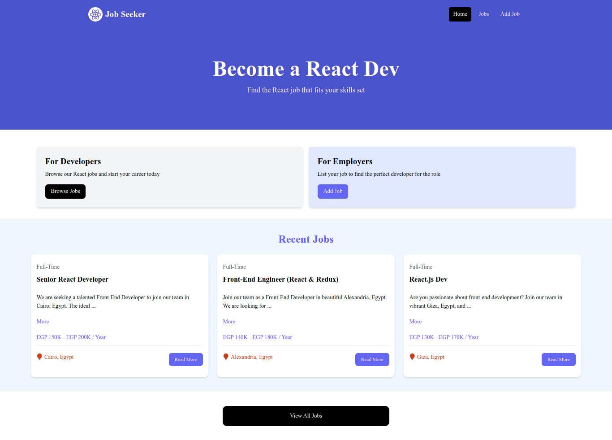
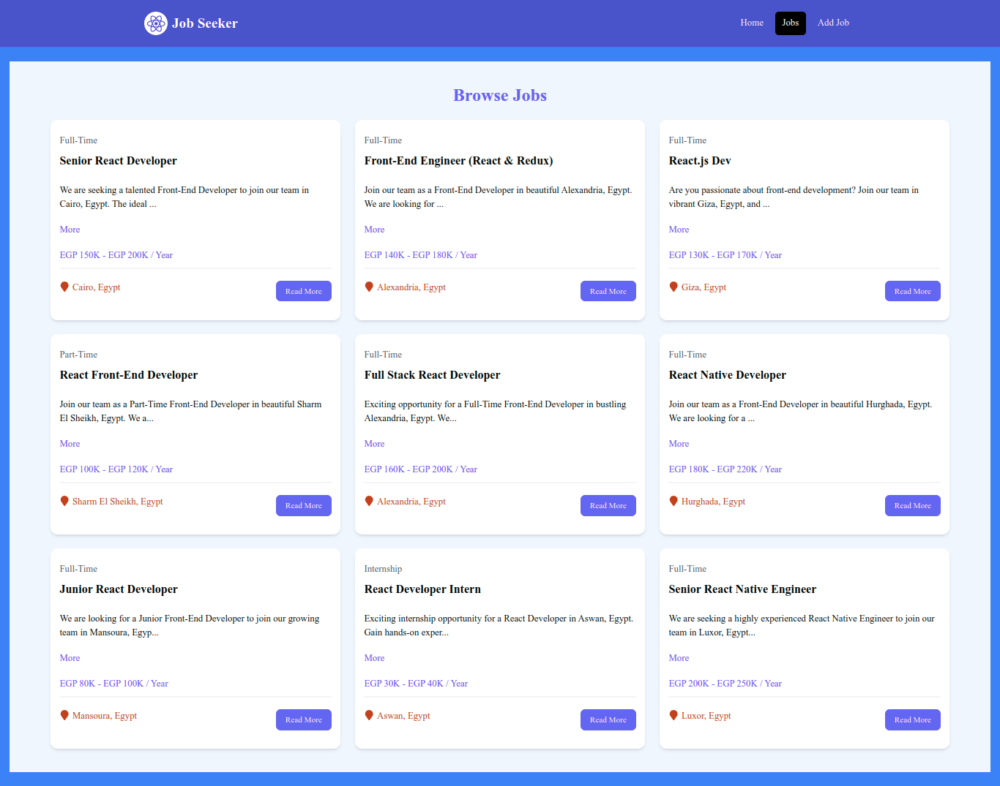

# Job-Seeker 🌟

Welcome to the **Job-Seeker** app! 🚀 This is a React application designed to help job seekers find and manage job opportunities. It includes features like job listings and a user-friendly interface to make your job search efficient and enjoyable.

## 📚 Features

- **Job Listings**: Browse and search for job opportunities 🔍
- **User-Friendly Interface**: Easy to navigate and manage your job search 💼
- **Responsive Design**: Works on all devices 📱💻

## 📸 Screenshots

Here are some screenshots of the app:

- **Home Page**:

  

- **Job Listings Page**:

  

## 🚀 Getting Started

To get started with the Job-Seeker app, follow these steps:

1. **Clone the Repository**:

   ```bash
   git clone https://github.com/AnasHany2193/Job-Seeker.git
   cd Job-Seeker
   ```

2. **Install Dependencies**:

   ```bash
   npm install
   ```

3. **Start the Development Server**:

   ```bash
   npm run dev
   ```

   Your app will be running on `http://localhost:5000`.

4. **Run the Mock API Server**:

   In a separate terminal, start the JSON Server:

   ```bash
   npm run server
   ```

   The mock API server will be running on `http://localhost:4000`.

## 🛠️ Tools and Technologies

- **React**: A JavaScript library for building user interfaces ⚛️
- **Vite**: A fast build tool for modern web development ⚡
- **Tailwind CSS**: A utility-first CSS framework 🌈
- **JSON Server**: A simple way to create a mock API server 🌐

## ✨ Contributing

If you want to contribute to the development of this project, feel free to open an issue or submit a pull request. All contributions are welcome! 🌟

## 💬 Contact

For any questions or suggestions, you can reach out to me:

- **LinkedIn**: [Anas Hany](https://www.linkedin.com/in/anashany219/)
- **GitHub**: [AnasHany2193](https://github.com/AnasHany2193)

Happy job hunting! 🕵️‍♂️🔍